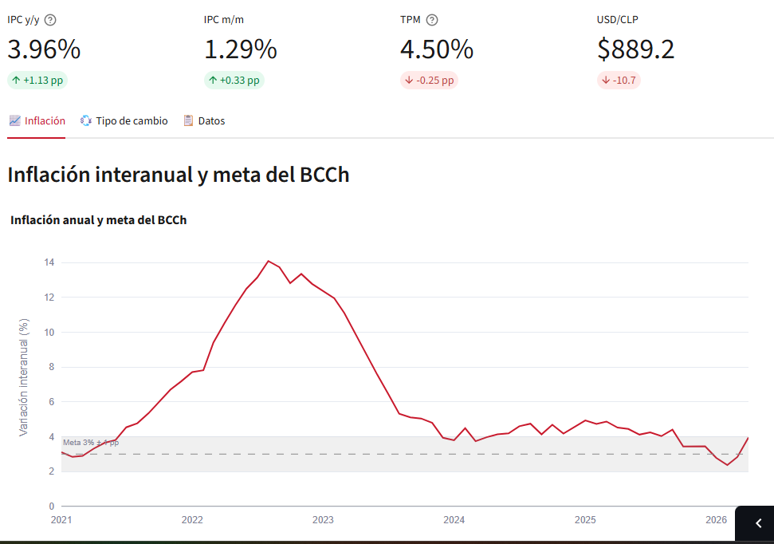
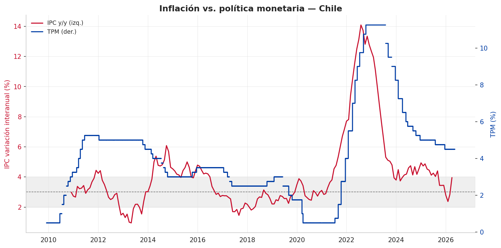
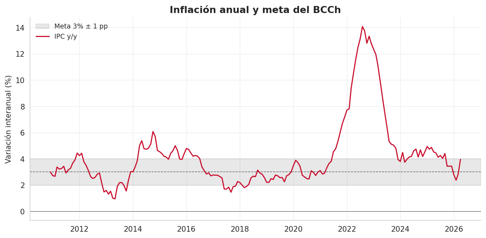
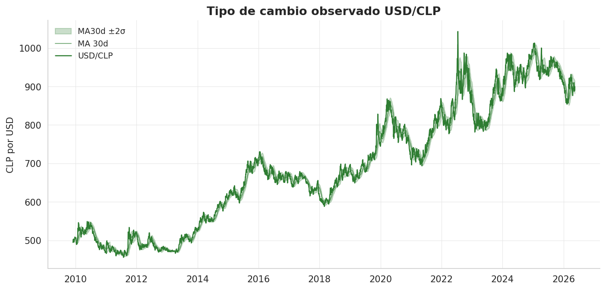

# BCCh Economic Data

Pipeline de extracción, almacenamiento y visualización de series económicas
del Banco Central de Chile (IPC, TPM, tipo de cambio observado).

## Series cubiertas

| Serie | Código BCCh | Frecuencia | Histórico |
|---|---|---|---|
| IPC empalmado | F074.IPC.IND.Z.EP23.C.M | Mensual | dic-2009 → presente |
| TPM | F022.TPM.TIN.D001.NO.Z.D | Diaria | 2009 → presente |
| USD/CLP observado | F073.TCO.PRE.Z.D | Diaria | 2009 → presente |

Fuente: API de Estadísticas Económicas del Banco Central de Chile.

[](https://nico-bcch1.streamlit.app/)

> 🚀 **[Dashboard interactivo en vivo](https://nico-bcch1.streamlit.app/)** — KPIs con deltas, selectores de rango de fechas y gráficos navegables con hover, zoom y pan.

## Hallazgo principal: política monetaria reactiva al subir, predictiva al transmitirse



La TPM alcanza su peak (11.25% en oct-2022) varios meses después del punto mas alto
de inflación (14% en ago-2022): el Banco Central exige evidencia sostenida
de desinflación antes de iniciar el ciclo de bajas. Al subir, la TPM va
detrás del IPC; una vez instalado el ciclo de alza, los efectos se
transmiten a la inflación con un rezago de 6-12 meses (validado con
correlaciones rezagadas en la capa de análisis).


## Inflación anual y meta del BCCh



Serie empalmada base dic-2023 = 100, con la banda 3% ± 1pp que el Central
usa como referencia operativa. Se ven el pico de la crisis 2008-2009, la
convergencia 2014-2019 y el pico post-pandemia que motivó el ciclo de alza
más agresivo en décadas. Otro punto de interes a considerar es la evolucion
del indicador durante los meses de 2026 derivados de la crisis y la guerra 
en Iran.

## Tipo de cambio USD/CLP con bandas de volatilidad



Nivel diario con media móvil de 30 días hábiles y banda ±2σ de volatilidad
realizada. La banda se ensancha en períodos de estrés (estallido social
2019, COVID 2020, ciclo de alza FED 2022).


## Arquitectura

```
src/
├── client/          # Cliente de la API REST del BCCh
├── extract/         # Orquestación de descargas
├── storage/         # Persistencia en SQLite con UPSERT idempotente
├── analysis/        # Transformaciones (variaciones, rolling, merge wide)
└── visualization/   # Tema base + funciones de gráficos reutilizables

config/series.yaml   # Catálogo declarativo de series
notebooks/           # Exploración y generación de figuras
reports/figures/     # PNG de salida
data/                # SQLite y parquets procesados (gitignored)
```

Flujo: `client` → `extract` → `storage` (SQLite) → `analysis` → `visualization`.

## Setup

1. Clonar el repo y crear entorno virtual:
```bash
   python -m venv .venv
   .venv\Scripts\Activate.ps1   # Windows
   source .venv/bin/activate    # macOS/Linux
```
2. Instalar dependencias: `pip install -r requirements.txt`
3. Copiar `.env.example` a `.env` y llenar con credenciales del BCCh
   (registro gratuito en si3.bcentral.cl)
4. Ejecutar los notebooks de `notebooks/` en orden, o usar los módulos
   de `src/` directamente desde scripts.

## Roadmap

- [x] Fase 1: setup del proyecto, repo, estructura
- [x] Fase 2: cliente API y primera ingesta
- [x] Fase 3: orquestación de extracción multi-serie
- [x] Fase 4: capa de análisis (variaciones, rolling, merge wide)
- [x] Fase 5: visualizaciones con matplotlib
- [x] Fase 6: dashboard interactivo con Streamlit
- [ ] Fase 7: tests, CI y ejecución programada